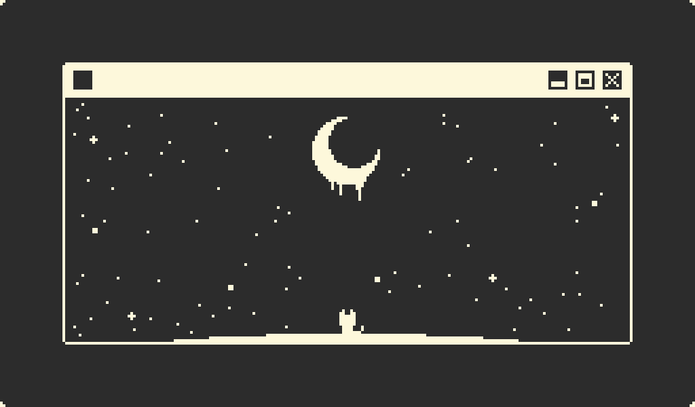

# Hello World👋 I'm HoangPC, a Vietnamese Coder🔥
I am pursuing a degree in Cyber Security at the Posts and Telecommunications Institute of Technology (PTIT).
<h2>🌱 Currently Studying:</h2>
        <ul>
            <li>Artificial Intelligence</li>
            <li>Machine Learning</li>
            <li>JLPT N3</li>
        </ul>
<h2>🚀 Languages and Tools I Use</h2>

    
    
    
    
    
    
    
    
    
    
    
    

